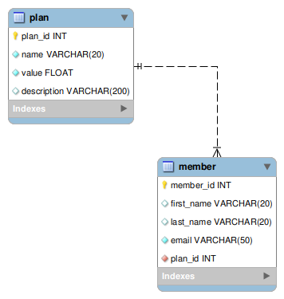

# 23-2-md-proj-sql-lightweight_baby

API RESTful para banco de dados de uma academia.

Link da demonstração da API handout 1: https://www.youtube.com/watch?v=fjvOza4TR4U
Link da demonstração da API e base de dados handout 2: https://www.youtube.com/watch?v=eX4xaRx2AJ4

Para acessar a API, rode usando os comandos abaixo na raiz do projeto e acesse o link http://localhost:8000/docs

``` bash
python3 -m venv gym
source gym/bin/activate
pip install -r docs/requirements.txt
uvicorn sql_app.main:app --reload
```
Crie seu arquivo .env a partir do template em docs/.env.example

Diagrama ER baseado no script em app_sql/trembolona.sql:



ANTES DE INICIAR O SERVIDOR RODAR NO SQL WORKBENCH:

``` bash
CREATE DATABASE trembolona;
```
